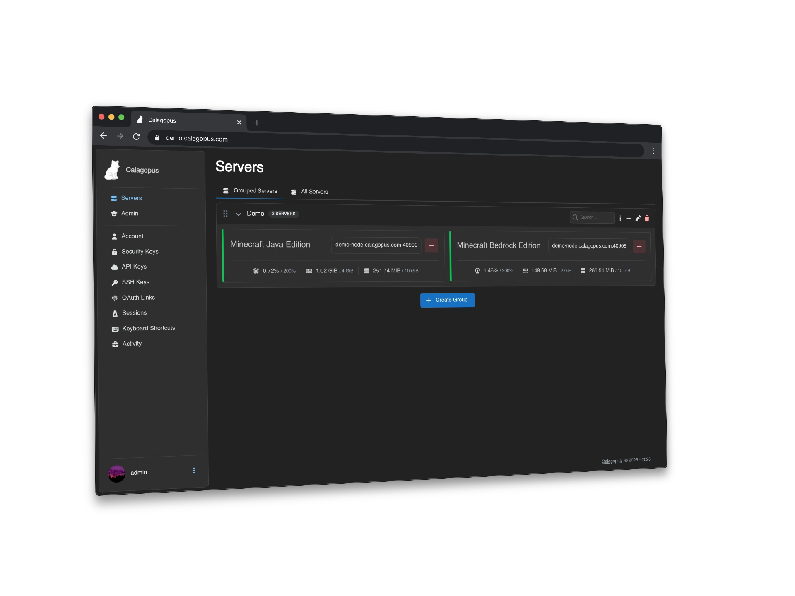

<!--
N.B. : Ce README a été généré automatiquement par https://github.com/YunoHost/apps/tree/main/tools/readme_generator
Il ne doit PAS être édité à la main.
-->

# Calagopus pour YunoHost

[](https://dash.yunohost.org/appci/app/calagopus)  <br>
[](https://install-app.yunohost.org/?app=calagopus)

*[Read this readme in English.](./README.md)*

> *Ce package vous permet d'installer Calagopus rapidement et simplement sur un serveur YunoHost.
> Si vous n'avez pas YunoHost, regardez [ici](https://yunohost.org/#/install) pour savoir comment l'installer et en profiter.*

## Vue d'ensemble

Calagopus est un panneau de gestion de serveurs de jeux open-source moderne construit avec Rust et React. Il offre une interface rapide et sécurisée pour déployer, surveiller et maintenir des serveurs de jeux — conçu aussi bien pour les utilisateurs individuels que pour les grands opérateurs d'hébergement.

Inspiré de Pterodactyl mais entièrement réécrit en Rust, Calagopus offre des performances nettement supérieures, assurées par les garanties de sécurité mémoire de Rust. Le backend utilise **axum** comme framework web, **PostgreSQL** via sqlx pour la persistance, et **Valkey/Redis** via rustis pour le cache.

### Fonctionnalités

- 🦀 **Backend en Rust** — amélioration du débit de plus de 32 800 % par rapport aux panneaux basés sur PHP
- ⚡ **Console en direct** — sortie du serveur en temps réel diffusée directement dans le navigateur
- 📂 **Gestionnaire de fichiers complet** — parcourir, téléverser, télécharger, éditer et extraire des archives depuis l'interface web
- 📜 **Historique des modifications** — suivi de chaque modification apportée aux fichiers du serveur
- 🗓️ **Tâches planifiées** — automatisation basée sur le temps et les événements
- 👥 **Gestion des sous-utilisateurs** — accès délégué sans droits administrateurs complets
- 💾 **Sauvegardes avancées** — plusieurs pilotes de sauvegarde avec navigation dans les archives
- 🔐 **Authentification WebAuthn** — clés d'accès, biométrie et clés de sécurité matérielles
- 🔗 **Support OAuth** — intégration avec des fournisseurs d'identité externes
- 🥚 **Système d'œufs (Eggs)** — compatible avec l'écosystème Pterodactyl pour tout jeu supportant Docker Linux (Minecraft, Rust, ARK, Valheim, FiveM, etc.)
- 🌐 **API REST complète** — chaque action du panneau est disponible via API
- 🔌 **API d'extensions** — ajoutez une logique backend, des routes, des éléments d'UI et des migrations de base de données personnalisés
- 📊 **Gestion des rôles, journaux d'activité, gestion des montages**, et plus encore

**Version incluse :** 1.0~ynh1

**Démo :** <https://demo.calagopus.com>

## Captures d'écran



## Avertissements / informations importantes

### Architecture de déploiement

Ce package YunoHost installe uniquement le **panneau Calagopus**. Pour héberger effectivement des serveurs de jeux, vous devez également disposer d'au moins un démon **Wings** sur un hôte Linux (qui peut être la même machine pour une configuration à nœud unique). Wings n'est pas inclus dans ce package.

### Configuration initiale

Après l'installation, ouvrez l'URL du panneau dans votre navigateur. L'assistant **OOBE** (Out-Of-Box Experience) vous guidera pour créer votre premier compte administrateur et configurer le panneau avant d'ajouter des nœuds Wings.

### Authentification

Calagopus **ne s'intègre pas** avec le système LDAP/SSO de YunoHost. Les utilisateurs sont gérés entièrement au sein du panneau Calagopus. Les indicateurs d'intégration `ldap` et `sso` sont donc définis à `false`.

### Architectures supportées

Ce package supporte uniquement **amd64** et **arm64**. Le dépôt APT de Calagopus ne fournit pas actuellement de paquets `armhf` (ARM 32 bits).

### Instance unique

Calagopus se lie au port 8000 (fixe). L'installation de plus d'une instance sur le même serveur n'est pas supportée (`multi_instance = false`).

### Ressources requises

- **RAM :** 512 Mo minimum en cours d'exécution (1 Go recommandé ; 2 Go si vous utilisez des extensions)
- **Disque :** 1 Go minimum (10 Go recommandé si vous utilisez des extensions)

### Fichier d'environnement

Le panneau est configuré via `/etc/calagopus/.env`. N'éditez pas ce fichier manuellement — YunoHost l'écrasera lors de la mise à jour. La valeur `APP_ENCRYPTION_KEY` est générée une fois à l'installation et ne doit **jamais** être modifiée sans re-chiffrer tous les secrets stockés.

### Processus de mise à jour

Les mises à jour sont effectuées via le dépôt APT de Calagopus (`apt update && apt upgrade -y calagopus-panel`) et ne nécessitent aucune étape manuelle. Le service du panneau sera brièvement indisponible pendant le redémarrage.

## Documentations et ressources

- Site officiel de l'app : <https://calagopus.com>
- Documentation officielle utilisateur : <https://calagopus.com/docs>
- Documentation officielle de l'admin : <https://calagopus.com/docs>
- Dépôt de code officiel de l'app : <https://github.com/calagopus/panel>
- YunoHost Store : <https://apps.yunohost.org/app/calagopus>
- Signaler un bug : <https://github.com/YunoHost-Apps/calagopus_ynh/issues>

## Informations pour les développeurs

Merci de faire vos pull request sur la [branche testing](https://github.com/YunoHost-Apps/calagopus_ynh/tree/testing).

Pour essayer la branche testing, procédez comme suit :

```bash
sudo yunohost app install https://github.com/YunoHost-Apps/calagopus_ynh/tree/testing --debug
# ou
sudo yunohost app upgrade calagopus -u https://github.com/YunoHost-Apps/calagopus_ynh/tree/testing --debug
```

**Plus d'infos sur le packaging d'applications :** <https://doc.yunohost.org/dev/packaging/>
